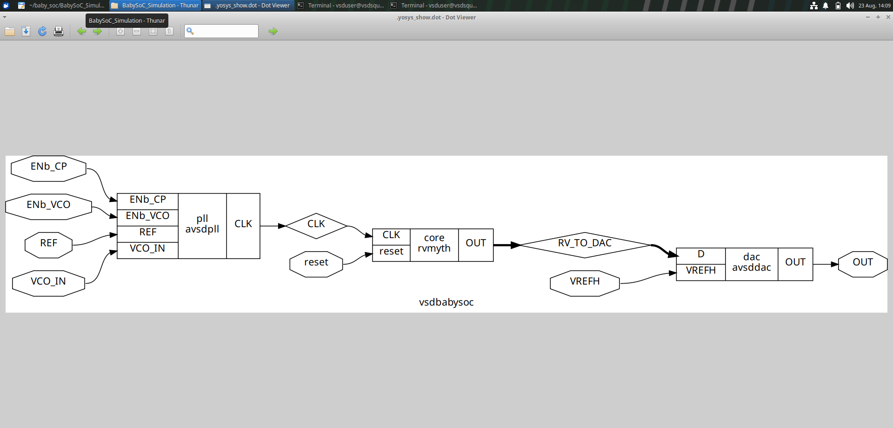
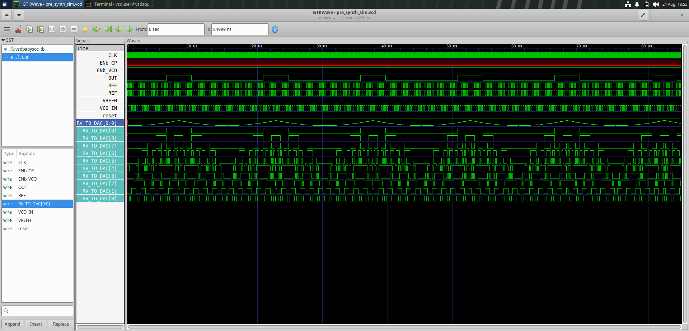
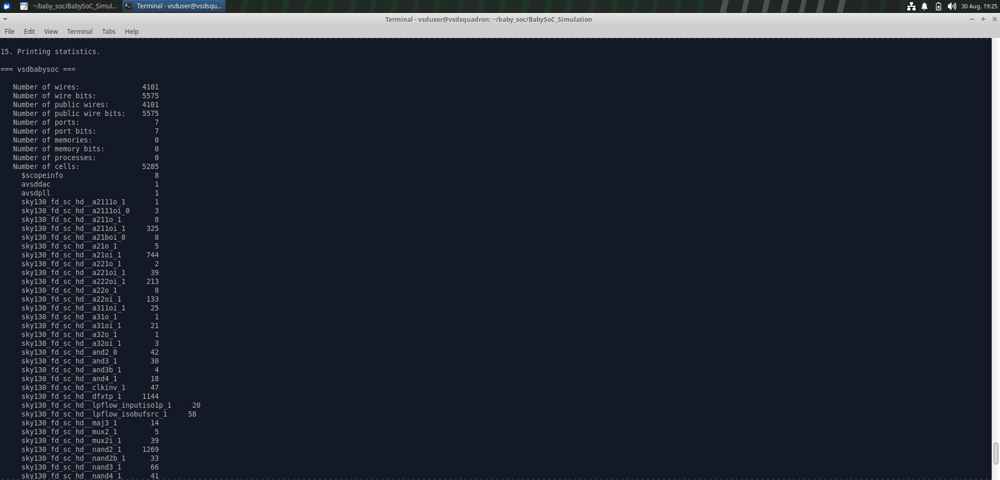
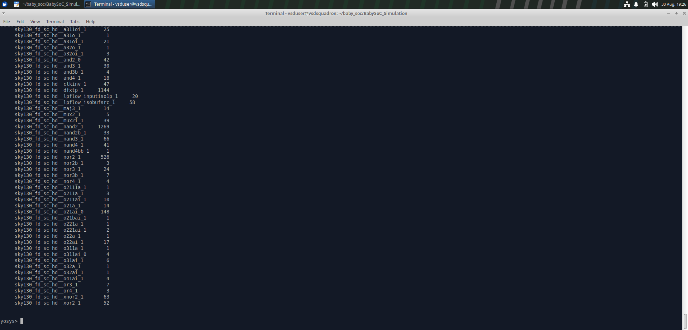
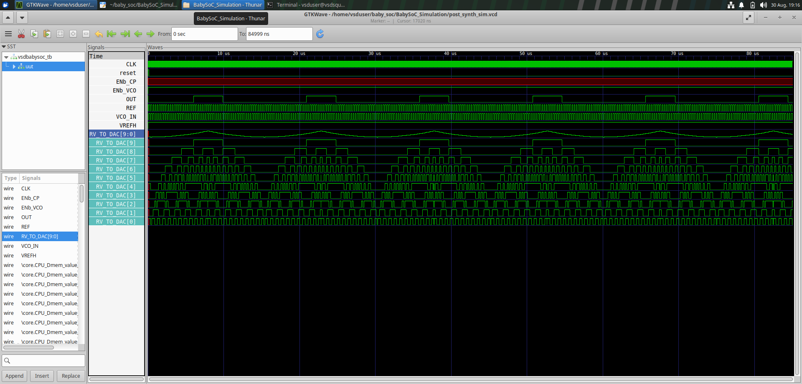

# VSDIAT BabySoC – RTL to Post-Synthesis Flow

This repository documents my hands-on work on **BabySoC design and ASIC implementation flow** as part of my VSDIAT / VLSI training.

The project focuses on understanding how a **System-on-Chip (SoC)** moves from **RTL description to a synthesized gate-level implementation**, followed by functional post-synthesis simulation.

---

## Project Overview

The BabySoC consists of three major blocks:

- **RVMyth** – RISC-V based digital processor core
- **AVSDPLL** – PLL block used for clock generation
- **AVSDDAC** – DAC block used to convert the digital output from the processor

The top-level module is:

```text
vsdbabysoc
```

---

## BabySoC Architecture

```text
                         ┌──────────────┐
 ENb_CP ────────────────►│              │
 ENb_VCO ───────────────►│   AVSDPLL    │
 REF ───────────────────►│     PLL      │─── CLK ───┐
 VCO_IN ────────────────►│              │            │
                         └──────────────┘            ▼
                                                ┌──────────┐
                                         reset ─►│  RVMyth  │
                                                │   CPU    │
                                                └────┬─────┘
                                                     │
                                                RV_TO_DAC[9:0]
                                                     │
                                                     ▼
                                                ┌──────────┐
                                         VREFH ─►│ AVSDDAC  │
                                                │   DAC    │
                                                └────┬─────┘
                                                     │
                                                     ▼
                                                    OUT
```

---

## Design Hierarchy

The top-level BabySoC hierarchy contains:

```text
vsdbabysoc
├── avsddpll
├── rvmyth
└── avsddac
```

The `rvmyth` block contains the main digital processing logic and generates the 10-bit:

```text
RV_TO_DAC[9:0]
```

This digital signal is provided to the DAC block.

The PLL generates the clock used by the digital core.

---

# ASIC Design Flow

The BabySoC is being taken through the following stages:

```text
RTL Design
    │
    ▼
Pre-Synthesis Simulation
    │
    ▼
Logic Synthesis
    │
    ▼
Technology Mapping
    │
    ▼
Gate-Level Netlist
    │
    ▼
Post-Synthesis Simulation
    │
    ▼
Static Timing Analysis
    │
    ▼
Physical Design
```

---

## Current Progress

| Stage | Status |
|---|---|
| BabySoC RTL | ✅ Completed |
| Pre-Synthesis Simulation | ✅ Completed |
| Yosys Synthesis | ✅ Completed |
| SKY130 Technology Mapping | ✅ Completed |
| Gate-Level Netlist | ✅ Completed |
| Post-Synthesis Simulation | ✅ Completed |
| Static Timing Analysis | 🔄 Upcoming |
| Floorplanning | ⏳ Upcoming |
| Placement | ⏳ Upcoming |
| CTS | ⏳ Upcoming |
| Routing | ⏳ Upcoming |
| GDSII | ⏳ Upcoming |

---

# 1. RTL Design

The BabySoC RTL is described using **Verilog HDL**.

Important modules include:

```text
rtl/
├── vsdbabysoc.v
├── rvmyth.v
└── clk_gate.v
```

The top-level module is:

```text
vsdbabysoc
```

At the RTL level, the design describes the intended hardware behavior without being tied to individual physical standard cells.

---

# 2. Pre-Synthesis Simulation

Before synthesis, the RTL was simulated using:

- **Icarus Verilog**
- **GTKWave**

The simulation verifies the functional behavior of the RTL implementation.

## Simulation Flow

```text
RTL
 │
 ▼
Icarus Verilog
 │
 ▼
VCD waveform
 │
 ▼
GTKWave
```

## Important Signals

The following signals were observed during the simulation:

```text
CLK
REF
reset
VCO_IN
VREFH
RV_TO_DAC[9:0]
OUT
```

The `RV_TO_DAC[9:0]` bus represents the digital data generated by the processor and supplied to the DAC.

---

# 3. Logic Synthesis Using Yosys

**Yosys** was used to synthesize the BabySoC RTL.

The synthesis process converts the RTL description into a gate-level representation.

## Synthesis Flow

```text
Read RTL
   │
   ▼
Optimization
   │
   ▼
Flip-Flop Mapping
   │
   ▼
Logic Optimization and Technology Mapping
   │
   ▼
SKY130 Standard Cells
   │
   ▼
Gate-Level Netlist
```

The SKY130 standard-cell library used for synthesis is:

```text
sky130_fd_sc_hd
```

The Liberty timing library used for synthesis is:

```text
sky130_fd_sc_hd__tt_025C_1v80.lib
```

---

# 4. Synthesis Commands

The major Yosys synthesis commands used were:

```text
read_verilog
dfflibmap
opt
abc
show
flatten
setundef -zero
clean -purge
rename -enumerate
write_verilog
```

## Important Commands

### `read_verilog`

Reads the Verilog RTL source files into Yosys.

### `dfflibmap`

Maps Yosys flip-flop representations to suitable flip-flop cells from the target standard-cell library.

### `opt`

Performs logic optimizations such as constant propagation and removal of redundant logic.

### `abc`

Performs logic optimization and technology mapping using the SKY130 Liberty library.

### `show`

Generates a graphical representation of the selected design or module.

### `flatten`

Removes module hierarchy by incorporating lower-level module logic into the parent module.

### `setundef -zero`

Converts undefined values in the synthesized representation to logic zero.

### `clean -purge`

Removes unused and redundant objects from the design.

### `rename -enumerate`

Renames generated objects systematically.

### `write_verilog`

Writes the resulting synthesized design as a Verilog gate-level netlist.

---

# 5. SKY130 Technology Mapping

After technology mapping, the design contains actual **SKY130 standard-cell instances** instead of only generic RTL or logic representations.

Examples of mapped cells include:

```text
sky130_fd_sc_hd__nand2_1
sky130_fd_sc_hd__nor2_1
sky130_fd_sc_hd__and2_0
sky130_fd_sc_hd__mux2_1
sky130_fd_sc_hd__xor2_1
sky130_fd_sc_hd__dfrtp_1
```

The synthesis results contained thousands of standard-cell instances.

This demonstrates the transformation from:

```text
RTL Description
```

to:

```text
Technology-Mapped Hardware Implementation
```

---

# 6. Gate-Level Netlist

The synthesized BabySoC was written to:

```text
baby_soc_netlist3.v
```

The generated netlist represents the synthesized implementation using SKY130 standard cells.

## Netlist Generation Flow

```text
RTL Verilog
     │
     ▼
   Yosys
     │
     ▼
Optimized Logic
     │
     ▼
ABC Technology Mapping
     │
     ▼
SKY130 Standard Cells
     │
     ▼
Gate-Level Netlist
```

The gate-level netlist is used as the input for post-synthesis simulation.

---

# 7. Post-Synthesis Simulation

The synthesized netlist was simulated using:

- **Icarus Verilog**
- **SKY130 Verilog cell models**
- **Original testbench**
- **GTKWave**

The post-synthesis simulation was configured using:

```text
-DPOST_SYNTH_SIM
-DFUNCTIONAL
-DUNIT_DELAY=#1
```

The SKY130 Verilog models provide the functional behavior of the standard cells used in the synthesized netlist.

## Post-Synthesis Simulation Flow

```text
Gate-Level Netlist
        │
        ├── SKY130 Cell Models
        │
        └── Testbench
                │
                ▼
         Icarus Verilog
                │
                ▼
      post_synth_sim.vcd
                │
                ▼
            GTKWave
```

The simulation completed successfully and generated the post-synthesis VCD waveform.

---

# 8. RTL vs Post-Synthesis Verification

The pre-synthesis and post-synthesis simulations were compared using **GTKWave**.

The main signals examined were:

```text
CLK
REF
reset
RV_TO_DAC[9:0]
OUT
```

The synthesized implementation produced the expected functional activity observed in the RTL simulation.

In particular, the `RV_TO_DAC[9:0]` digital output continues to show the expected sequence after synthesis, and the DAC output `OUT` continues to exhibit the expected waveform behavior.

This indicates that the synthesized gate-level implementation preserves the functional behavior of the RTL for the applied testbench.

---

# 9. Functional Simulation vs Timing Simulation

The current post-synthesis simulation is primarily a **functional gate-level simulation**.

This verifies that the synthesized gates produce the expected logical behavior.

It should be distinguished from:

- **Functional GLS**
- **Timing GLS**

## Functional GLS

Functional Gate-Level Simulation verifies the logical behavior of the synthesized netlist using the standard-cell functional models.

## Timing GLS

Timing-aware Gate-Level Simulation additionally models propagation delays through cells and, depending on the stage of the flow, interconnect delays.

Static Timing Analysis will be used later to verify timing constraints more systematically.

---

# 10. Tools and Technologies

## HDL

- Verilog HDL

## Simulation

- Icarus Verilog
- GTKWave

## Synthesis

- Yosys
- ABC

## Technology

- SKY130
- `sky130_fd_sc_hd` standard-cell library

## Operating Environment

- Linux

---

# Results

The following images provide visual evidence of the BabySoC implementation flow.

## BabySoC Architecture



## Pre-Synthesis Simulation



## Synthesis Results





## Post-Synthesis Simulation



---

# Key Learning

Through the BabySoC implementation, I learned how an RTL-based SoC moves through the initial stages of an ASIC design flow.

The main concepts learned include:

- Understanding the hierarchy of a small SoC
- RTL-based hardware description
- Pre-synthesis functional simulation
- Logic synthesis using Yosys
- Logic optimization
- Flip-flop mapping
- Technology mapping using ABC
- SKY130 standard-cell libraries
- Gate-level netlists
- Functional post-synthesis simulation
- Comparing RTL and synthesized behavior
- Understanding the difference between RTL, synthesized netlist, and physical implementation

## Major Takeaway

> Synthesis transforms an RTL description of hardware into an optimized implementation using cells from a target technology library while attempting to preserve the intended functional behavior.

---

# Current Milestone

The BabySoC has successfully progressed through:

```text
RTL
  ↓
Pre-Synthesis Simulation
  ↓
Yosys Synthesis
  ↓
SKY130 Technology Mapping
  ↓
Gate-Level Netlist
  ↓
Post-Synthesis Simulation
```

## Next Stage

The next major stage is:

```text
Static Timing Analysis (STA)
```

followed by the physical design stages of the ASIC flow:

```text
Static Timing Analysis
        ↓
Floorplanning
        ↓
Placement
        ↓
Clock Tree Synthesis
        ↓
Routing
        ↓
Physical Verification
        ↓
GDSII
```

---

## Project Status

**Current :** RTL → Post-Synthesis Simulation ✅

