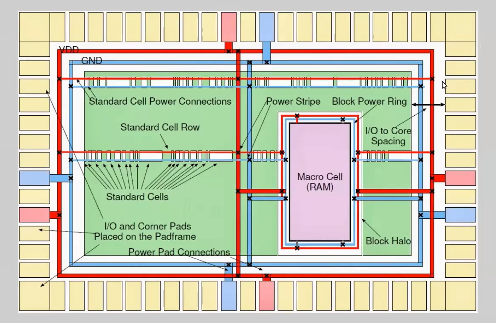
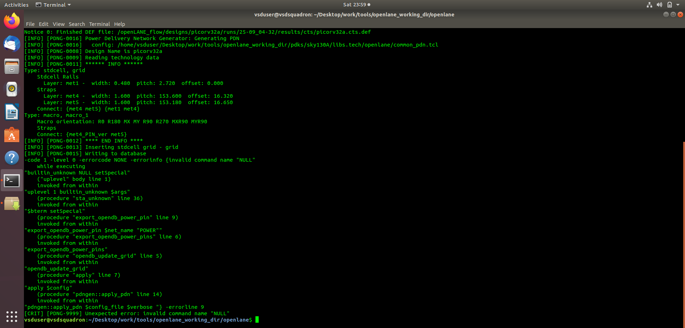
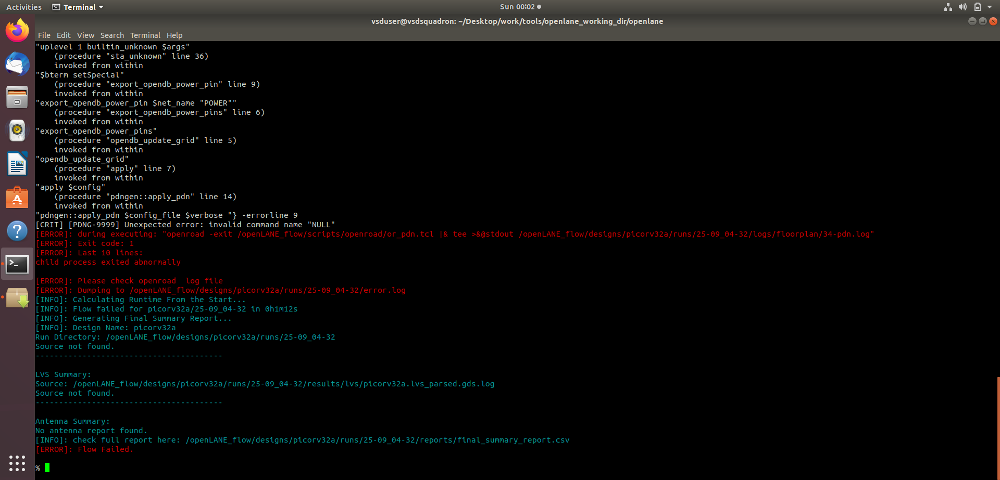
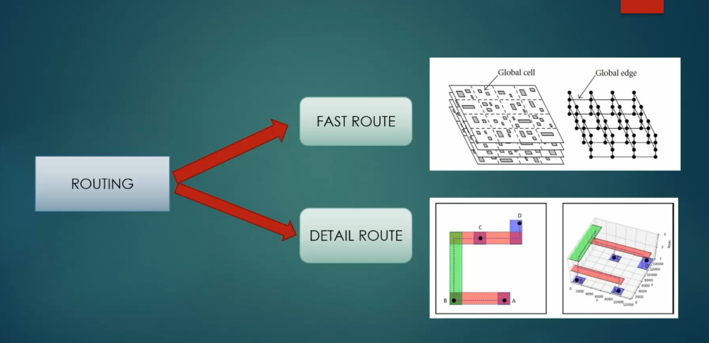
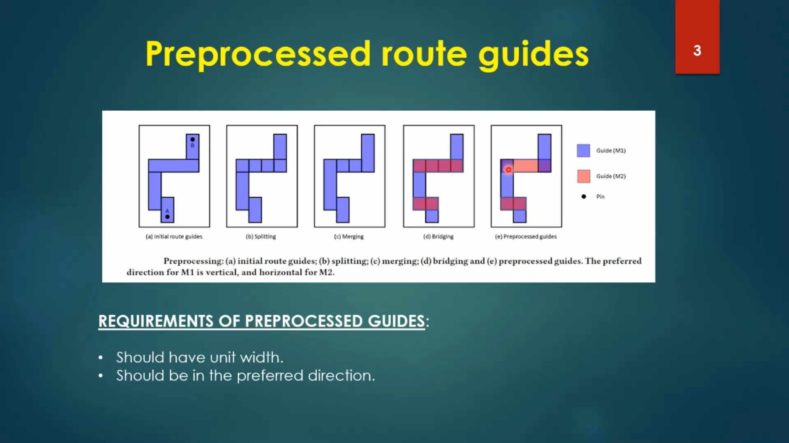
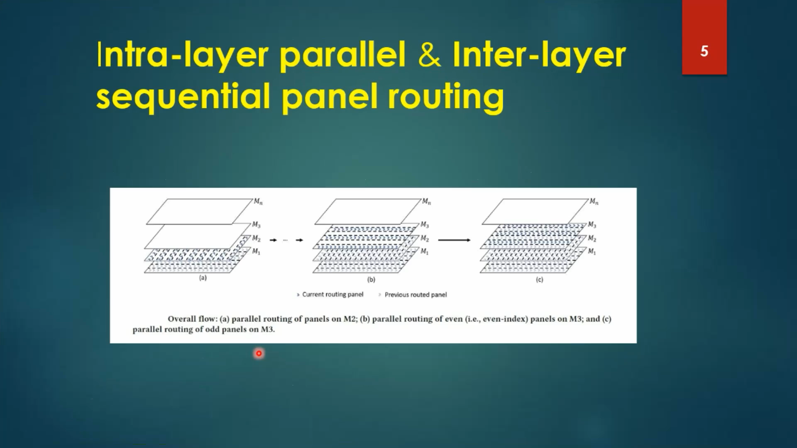
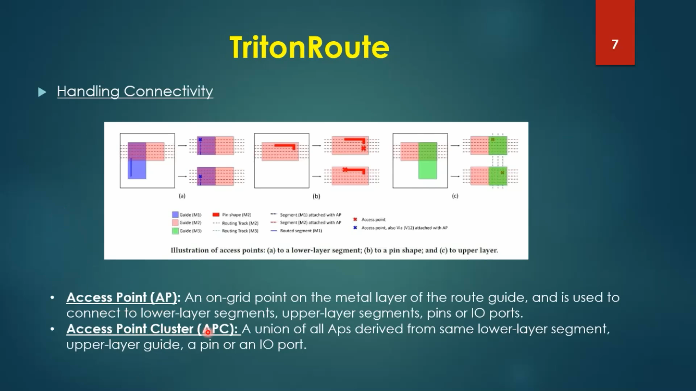

# SKY130 Module 5 – Final Steps of Physical Design

## Overview

This module covers the final stages of the SKY130 physical design flow, with focus on:

- Routing and design concepts
- Maze routing and Lee's algorithm
- Parasitic extraction
- Power Distribution Network (PDN)
- TritonRoute routing features
- Route-guide preprocessing
- Panel-based routing
- Connectivity and access points
- Practical routing of the `picorv32a` design using OpenLane/OpenROAD

The practical implementation was performed using the `picorv32a` design with the SKY130 technology and OpenLane physical-design flow.

---

## Module 5 Structure

This module is divided into three major sections:

1. **SKY130_D5_SK1 – Routing and Design**
2. **SKY130_D5_SK2 – Power Distribution**
3. **SKY130_D5_SK3 – TritonRoute Features**

---

# SKY130_D5_SK1 – Routing and Design

## Introduction to Routing

Routing establishes physical interconnections between standard-cell pins, macros, and I/O connections using the available metal layers and vias.

The routing process must satisfy physical and technology constraints such as:

- Metal-layer constraints
- Routing tracks
- Preferred routing directions
- Via requirements
- Connectivity
- Design-rule constraints


## Maze Routing and Lee's Algorithm

Lee's algorithm is a classical maze-routing method based on wave propagation through a routing grid.

The general process is:

1. Start from the source location.
2. Assign a distance value to the source.
3. Expand to neighboring grid locations.
4. Continue until the destination is reached.
5. Backtrack from the destination to construct the route.


## Parasitic Extraction

After routing, physical interconnects introduce parasitic resistance and capacitance.

The routed `picorv32a` design generated a SPEF file:

```text
picorv32a.spef
```

SPEF represents extracted parasitic information that can be used for post-route timing analysis.


## Practical Routing Result

The `picorv32a` design was routed using the OpenLane physical-design flow.

Run tag:

```text
25-09_04-32
```

The routing stage reported:

```text
[INFO]: Routing completed for picorv32a/25-09_04-32
```

The routing results included:

```text
picorv32a.def
picorv32a.def.png
picorv32a.def.ref
picorv32a.spef
```


---

# SKY130_D5_SK2 – Power Distribution

## Power Distribution Network

The Power Distribution Network (PDN) provides power and ground connectivity throughout the physical design.

A typical PDN contains structures such as:

- Standard-cell power rails
- Power straps
- Power rings
- Macro power connections
- VDD and GND connections



## PDN Generation

The PDN stage was executed for `picorv32a` using the SKY130 PDN configuration.

The OpenROAD PDN generator reached standard-cell grid insertion and database writing:

```text
[INFO] [PDNG-0013] Inserting stdcell grid - grid
[INFO] [PDNG-0015] Writing to database
```

## PDN Generation Error

The original OpenROAD PDN flow then encountered an OpenDB BTerm-related error:

```text
invalid command name "NULL"
```

The error occurred during the power-pin export path:

```text
export_opendb_power_pin
        ↓
$bterm setSpecial
        ↓
NULL setSpecial
```

The flow finally reported:

```text
[CRIT] [PDNG-9999] Unexpected error: invalid command name "NULL"
```



## OpenLane Flow Failure

OpenLane subsequently reported that the OpenROAD PDN process exited abnormally:

```text
[ERROR] Exit code: 1
[ERROR] child process exited abnormally
[ERROR] Flow Failed.
```



## PDN Root-Cause Investigation

The failure was investigated at the OpenDB level.

The investigation showed that the `VPWR` and `VGND` BTerms already existed in the database. The BTerm creation path could therefore return `NULL` when attempting to create an already-existing BTerm.

A source-level modification was developed to reuse an existing BTerm and create a new BTerm only when it does not exist:

```tcl
set net [$block findNet $net_name]
set bterm [$block findBTerm $net_name]

if {$bterm == "NULL"} {
    set bterm [odb::dbBTerm_create $net "${net_name}"]
}

$bterm setSpecial
$bterm setSigType $signal_type
$bterm setIoType "INOUT"
```

A patched OpenROAD binary was successfully built from the same OpenROAD commit used by OpenLane v0.21.

> **Note:** The original PDN execution is documented as a failure/debugging result. It is not presented as a successfully completed PDN stage.

---

# SKY130_D5_SK3 – TritonRoute Features

## TritonRoute Overview

TritonRoute is the detailed-routing component used in the physical-design flow.

The training material covers routing features including:

- Fast routing
- Detailed routing
- Route-guide preprocessing
- Panel-based routing
- Connectivity handling
- Access points
- Routing topology

## Fast Route and Detailed Route

Routing can be divided conceptually into fast/global routing and detailed routing.



## Preprocessed Route Guides

Route-guide preprocessing includes operations such as:

- Splitting
- Merging
- Bridging
- Generation of preprocessed guides



## Intra-Layer Parallel and Inter-Layer Sequential Panel Routing

Panel-based routing divides the routing problem into manageable routing regions and supports routing across multiple metal layers.



## Connectivity and Access Points

TritonRoute uses access points to establish connectivity between routing objects.

An Access Point (AP) is an on-grid point on a metal layer used to connect routing segments, pins, I/O ports, or other routing layers.

An Access Point Cluster (APC) groups related access points.



---

# Practical Design Results

**Design:** `picorv32a`

**Technology:** SKY130

**Flow:** OpenLane v0.21

**OpenROAD:** 0.9.0

**Run Tag:** `25-09_04-32`

The routed design produced:

```text
picorv32a.def
picorv32a.def.png
picorv32a.def.ref
picorv32a.spef
```

The routing stage reported successful completion:

```text
[INFO]: Routing completed for picorv32a/25-09_04-32
```

---

# Tools and Technologies

| Tool / Technology | Purpose |
|---|---|
| OpenLane v0.21 | ASIC physical-design flow |
| OpenROAD 0.9.0 | Physical-design implementation |
| TritonRoute | Detailed routing |
| OpenDB | Physical-design database |
| SKY130 | Open-source 130 nm technology |
| Magic | Layout inspection |
| SPEF | Parasitic representation |
| picorv32a | Practical ASIC design |

---

# Key Learning Outcomes

After completing this module, the following concepts were studied and applied:

- Maze routing
- Lee's algorithm
- Physical routing constraints
- Parasitic extraction
- SPEF generation
- Power Distribution Network concepts
- Standard-cell power rails and metal straps
- OpenROAD PDN generation
- OpenDB BTerm debugging
- TritonRoute routing stages
- Route-guide preprocessing
- Panel-based routing
- Access points and access point clusters
- Practical routing of the `picorv32a` design

---

# Module Summary

Module 5 connects routing theory, power distribution, and TritonRoute concepts with practical ASIC physical-design implementation.

The `picorv32a` design was successfully routed and generated routed DEF and SPEF outputs.

The PDN stage was also investigated in detail. The original PDN flow encountered an OpenDB BTerm-related `NULL` error during database export. The issue was traced through the OpenROAD PDN call path, and a source-level BTerm-reuse modification was developed and compiled.

