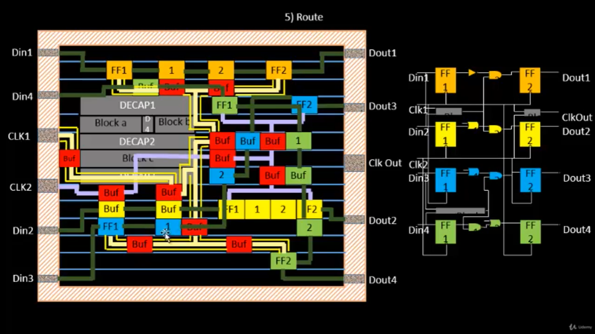
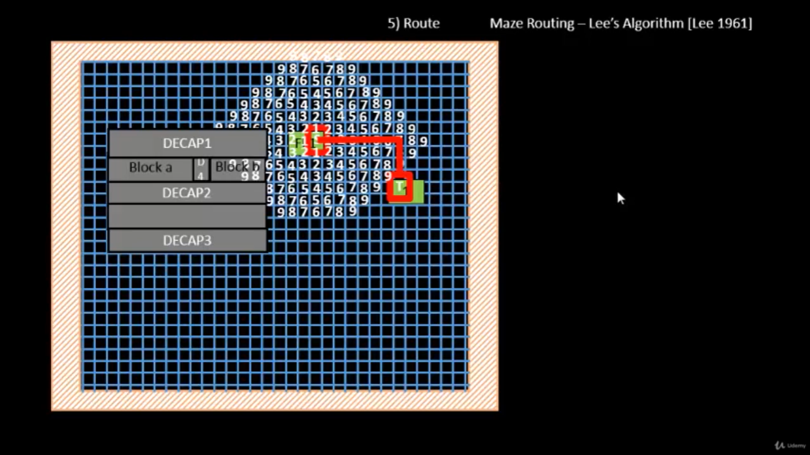
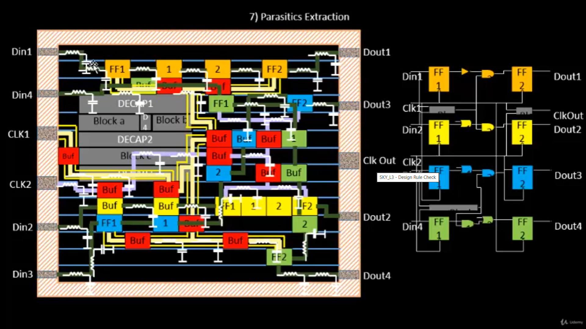
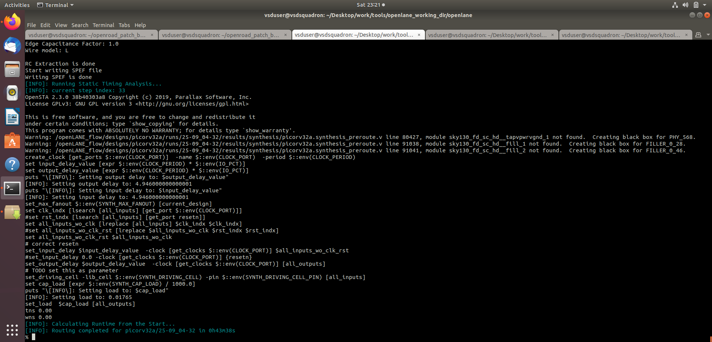

# SKY130_D5_SK1 – Routing and Design

## Overview

This section covers the routing stage of the SKY130 physical design flow, including maze routing, Lee's algorithm, routing concepts, and parasitic extraction.

The practical implementation uses the `picorv32a` design with OpenLane/OpenROAD and SKY130.

---

## 1. Introduction to Routing

Routing establishes physical interconnections between standard-cell pins, macros, and I/O connections using available metal layers and vias.

Routing must satisfy physical and technology constraints such as:

- Metal-layer constraints
- Routing tracks
- Preferred routing directions
- Via requirements
- Connectivity
- Design-rule constraints



---

## 2. Maze Routing and Lee's Algorithm

Lee's algorithm is a classical maze-routing method based on wave propagation through a routing grid.

The general procedure is:

1. Start from the source.
2. Assign a distance value to the source.
3. Expand to neighboring grid locations.
4. Continue the wave propagation until the destination is reached.
5. Backtrack from the destination to construct the route.



---

## 3. Parasitic Extraction

After routing, physical interconnects introduce parasitic resistance and capacitance.

The routed `picorv32a` design generated:

```text
picorv32a.spef
```

SPEF represents extracted parasitic information that can be used for post-route timing analysis.



---

## 4. Practical Routing – picorv32a

The `picorv32a` design was routed using the OpenLane physical-design flow.

**Run Tag:**

```text
25-09_04-32
```

The routing stage reported:

```text
[INFO]: Routing completed for picorv32a/25-09_04-32
```

The routing results included:

```text
picorv32a.def
picorv32a.def.png
picorv32a.def.ref
picorv32a.spef
```



---

## Key Learning Outcomes

- Understanding physical routing.
- Understanding maze-routing concepts.
- Understanding Lee's algorithm.
- Understanding routing constraints.
- Understanding parasitic extraction.
- Understanding the role of SPEF after routing.
- Connecting routing concepts with a practical `picorv32a` implementation.

---

## Tools Used

| Tool / Technology | Purpose |
|---|---|
| OpenLane v0.21 | ASIC physical-design flow |
| OpenROAD 0.9.0 | Physical-design implementation |
| SKY130 | 130 nm open-source technology |
| TritonRoute | Detailed routing |
| SPEF | Parasitic representation |
| picorv32a | Practical design |
