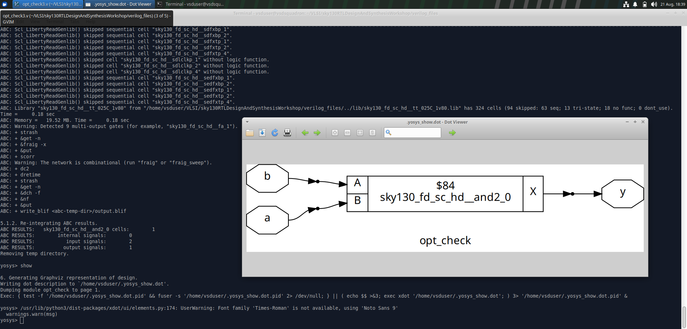
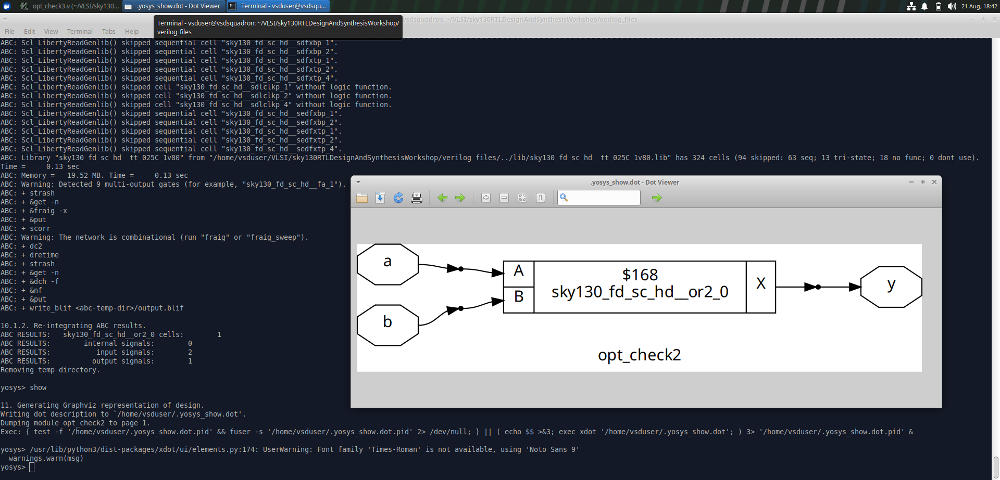
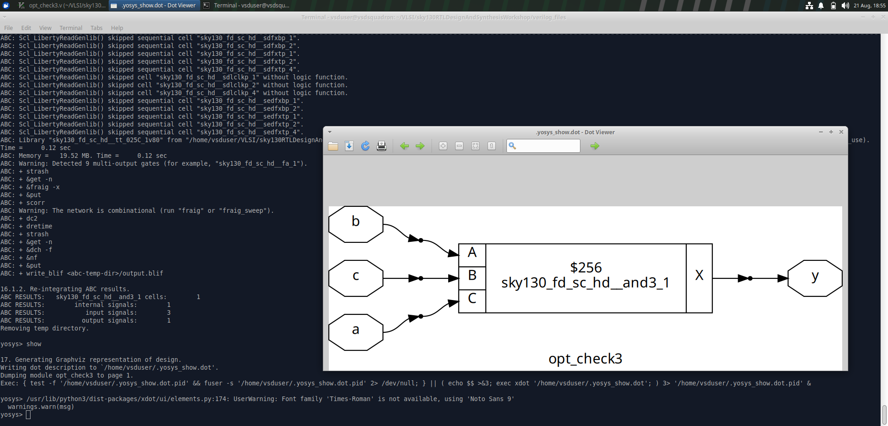
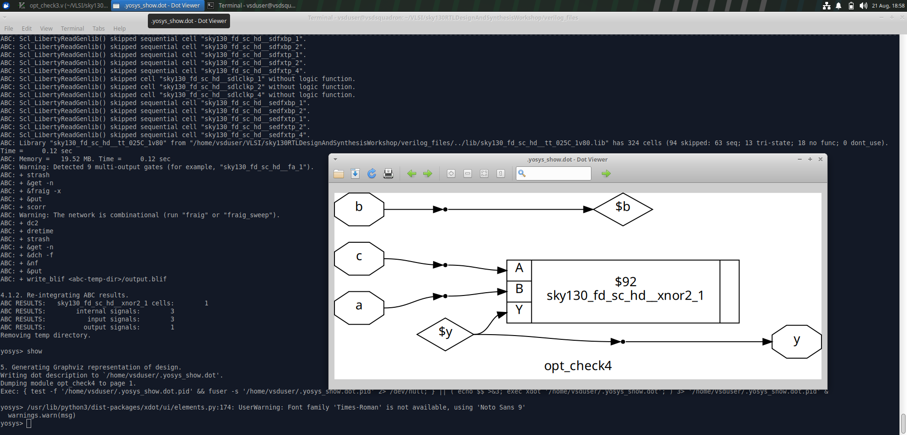
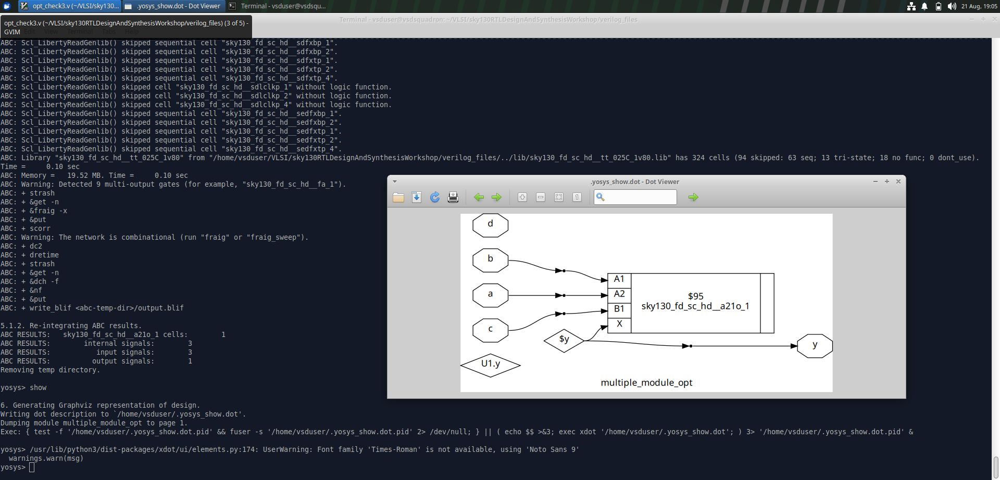

# Combinational Optimization

## Objective

To understand how synthesis tools optimize combinational RTL and map the resulting logic to SKY130 standard cells.

## Experiments

The experiments demonstrate different combinational RTL descriptions and how synthesis simplifies and optimizes the resulting logic.

## Synthesis Evidence

### Optimization Experiment 1

### Optimization Experiment 2

### Optimization Experiment 3

### Optimization Experiment 4

### Multiple Module Optimization

## Key Learning

- Combinational RTL optimization
- Logic simplification during synthesis
- Constant propagation and optimization
- Standard-cell mapping
- Understanding synthesized combinational structures
