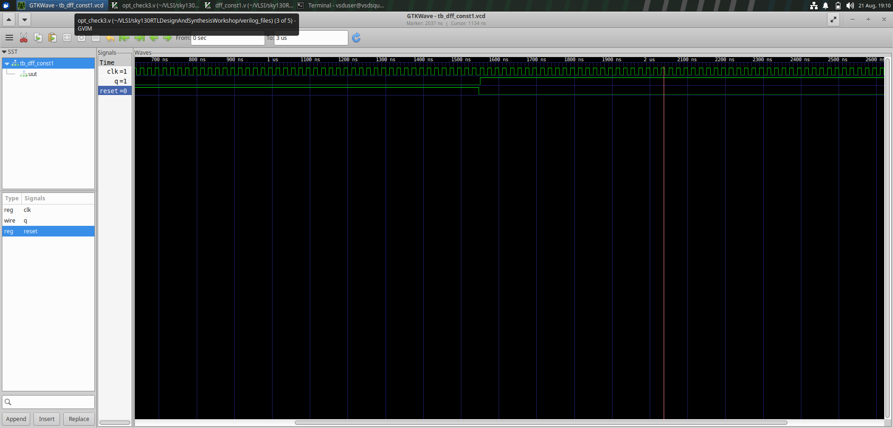
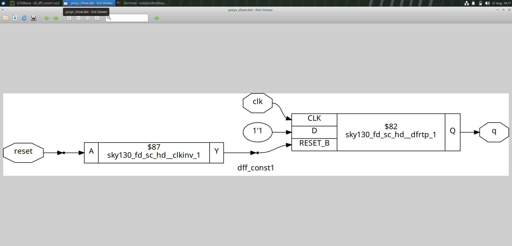
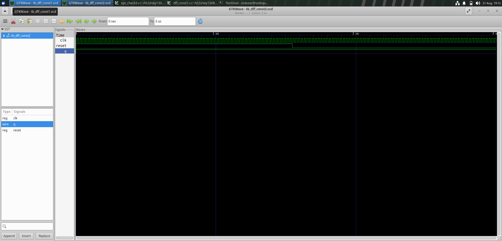
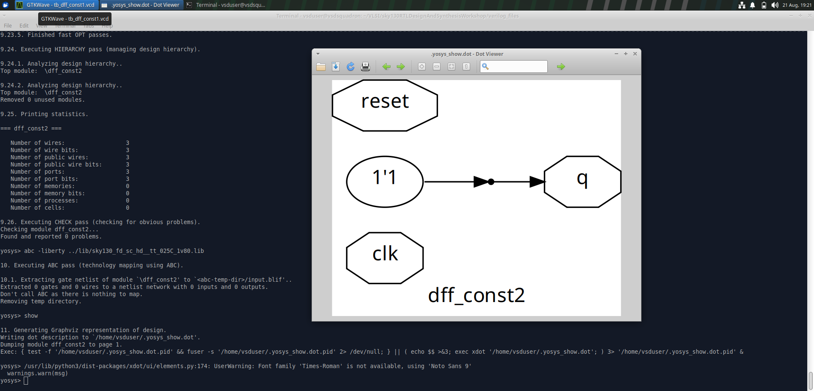
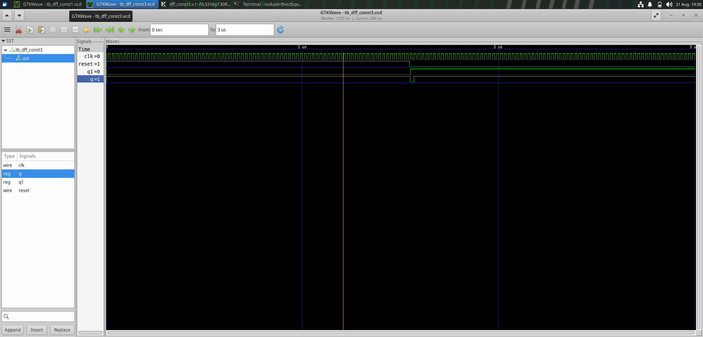
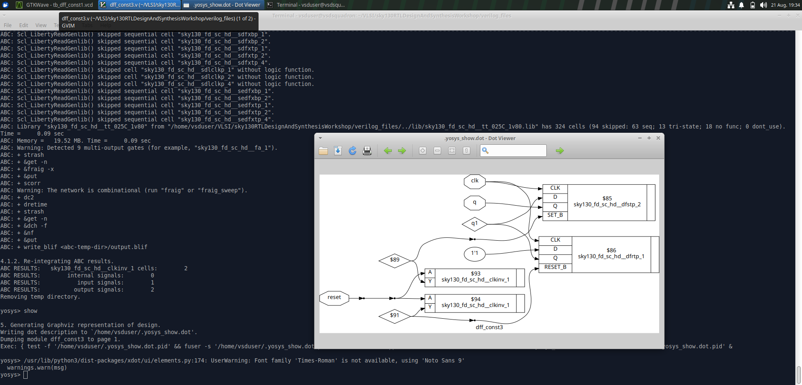
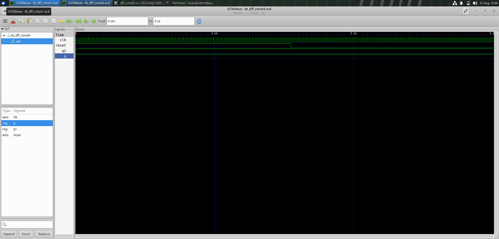
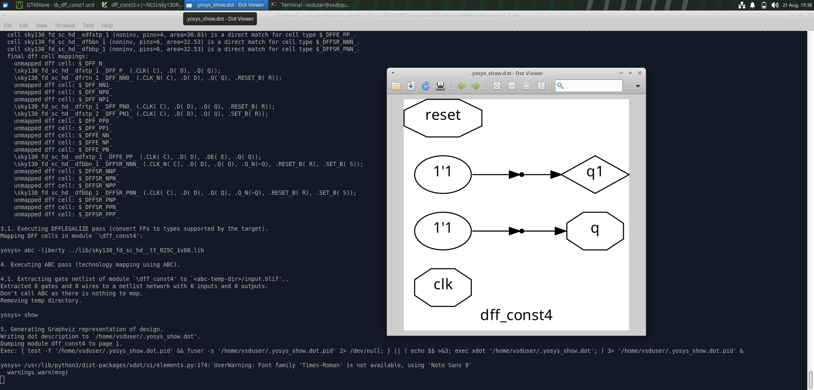
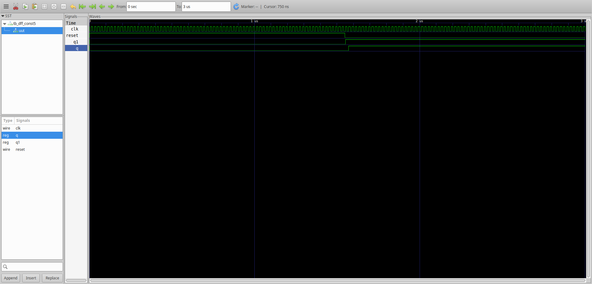
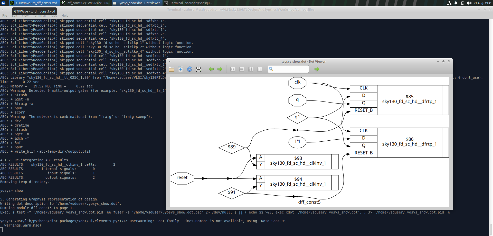

# Sequential Optimization

## Objective

To understand how synthesis tools optimize sequential RTL and simplify flip-flop based designs.

The experiments demonstrate how different RTL descriptions of sequential logic can result in optimized synthesized hardware.

---

## Experiments

Five sequential optimization experiments were studied using different DFF-based RTL descriptions.

| Experiment | RTL / Simulation Evidence | Synthesis Evidence |
|------------|---------------------------|--------------------|
| DFF Constant 1 | `dff_const1.png` | `dff_const1_synth.png` |
| DFF Constant 2 | `dff_const2.png` | `dff_const2_synth.png` |
| DFF Constant 3 | `dff_const3.png` | `dff_const3_synth.png` |
| DFF Constant 4 | `dff_const4.png` | `dff_const4_synth.png` |
| DFF Constant 5 | `dff_const5.png` | `dff_const5_synth.png` |

---

## Synthesis Evidence

### DFF Constant 1

---

### DFF Constant 2

---

### DFF Constant 3

---

### DFF Constant 4

---

### DFF Constant 5

---

## Key Learning

- Sequential RTL can be optimized during synthesis.
- Constant values can simplify sequential logic.
- Synthesis can eliminate unnecessary hardware.
- Different RTL descriptions can produce different synthesized structures.
- RTL behavior and synthesized implementation should be analyzed separately.
- Synthesized logic can be mapped to SKY130 standard cells.

---

## Tools Used

- **Yosys** – RTL synthesis
- **SKY130** – standard-cell technology
- **GTKWave** – waveform analysis
- **Graphviz / Yosys visualization** – synthesized netlist inspection
