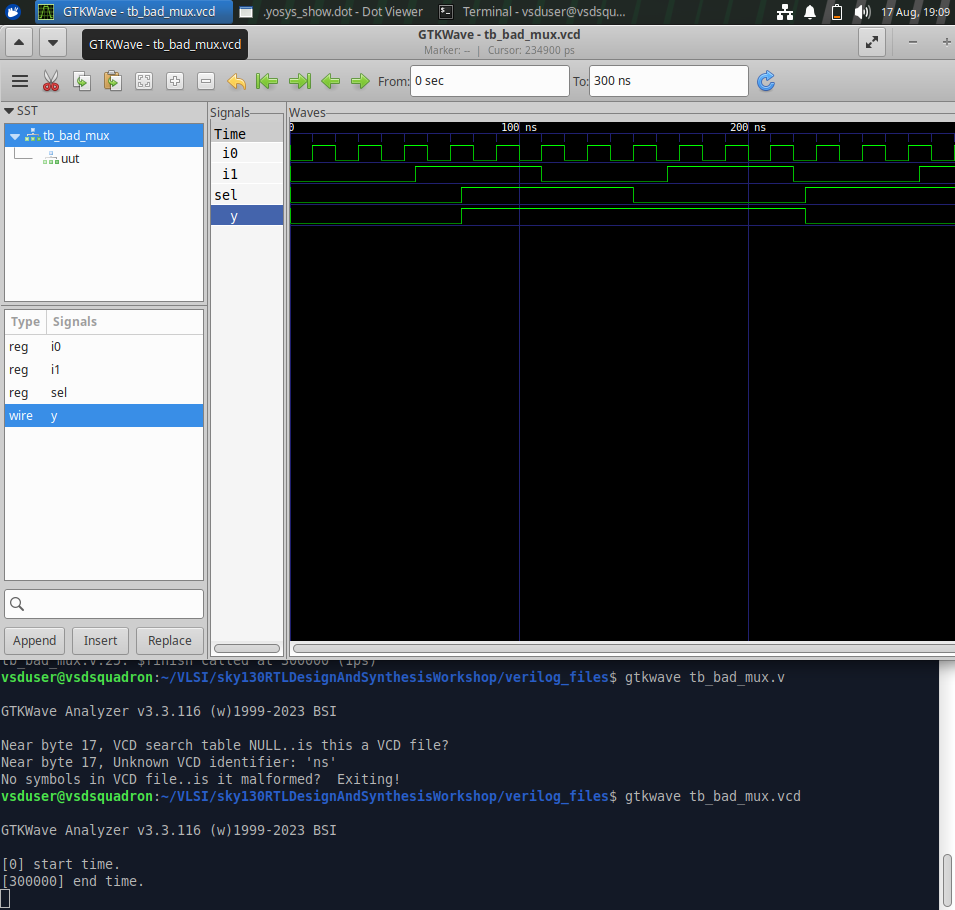
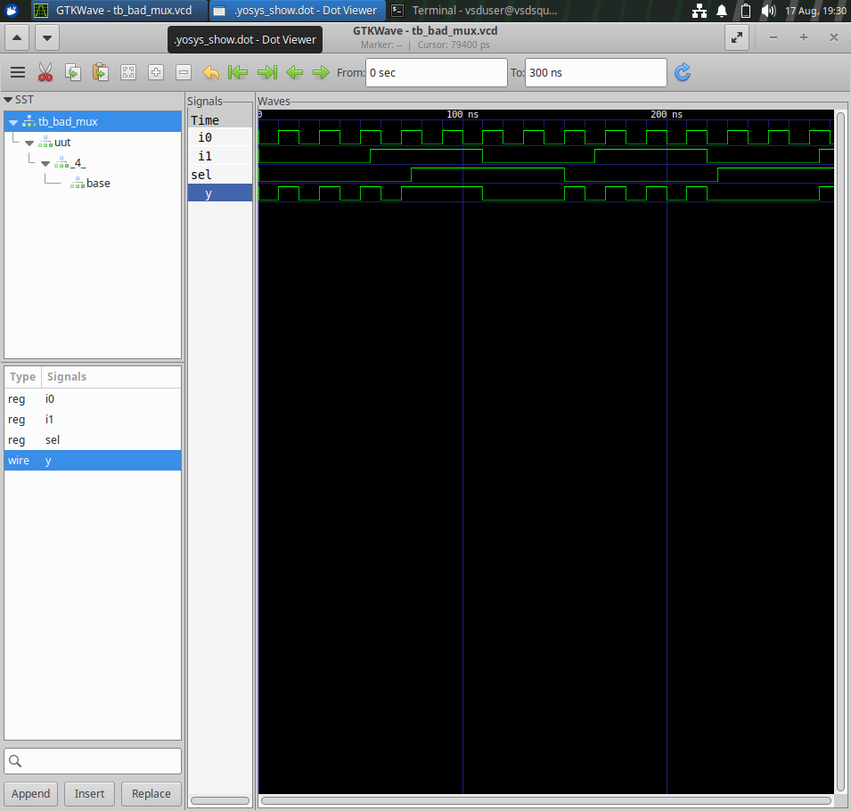
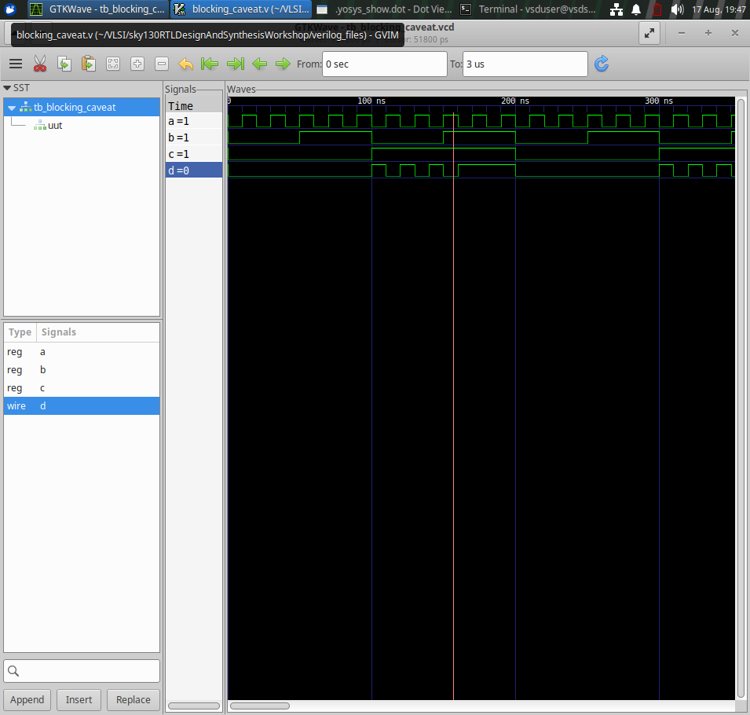
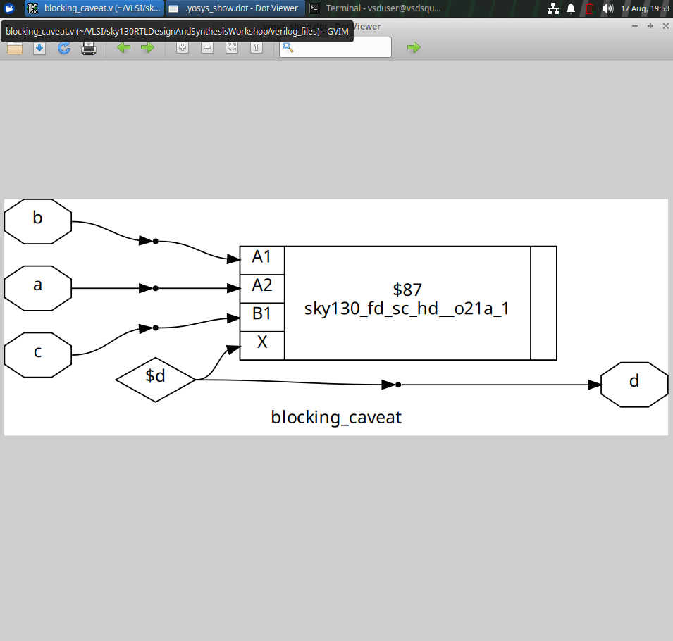
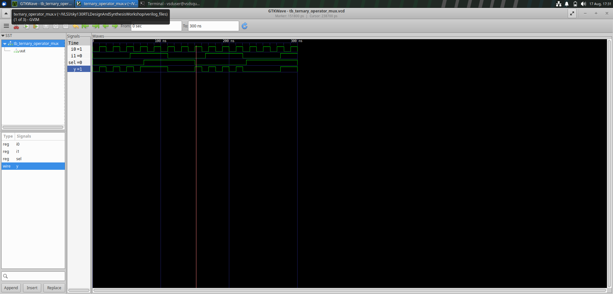
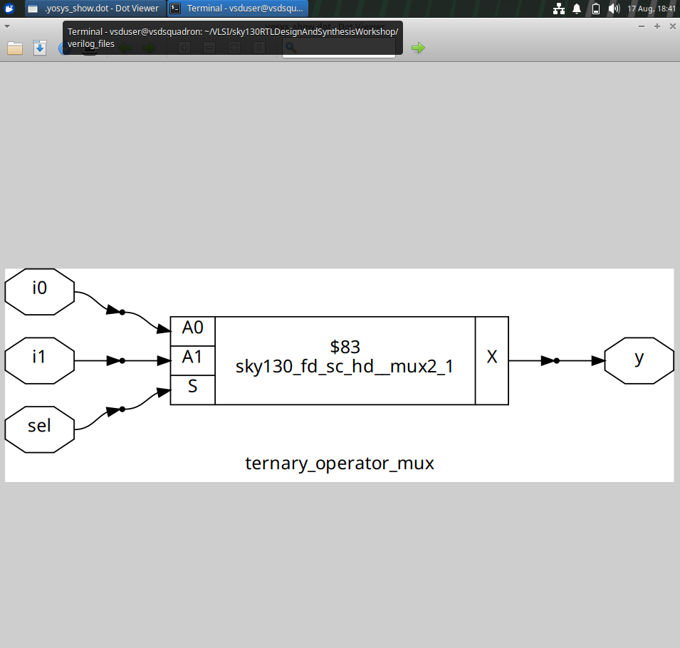

# Day 4 – GLS and Synthesis Simulation Mismatch

## Objective

To understand the differences between RTL simulation and synthesized/gate-level behavior and to study how RTL coding constructs can affect synthesis results.

## Experiments

The experiments covered:

- RTL simulation
- Synthesis analysis
- Gate-level simulation (GLS)
- Blocking assignment behavior
- Ternary operator based multiplexing
- Simulation and synthesis mismatch analysis

## Simulation and Synthesis Evidence

### Bad MUX

### Blocking Assignment Caveat

### Ternary Operator MUX

## Key Learning

- Understanding the purpose of gate-level simulation
- Comparing RTL simulation with synthesized behavior
- Understanding simulation and synthesis mismatches
- Understanding the effect of RTL coding style on synthesis
- Understanding blocking assignment behavior
- Understanding synthesis of ternary-operator based multiplexers
- Inspecting synthesized and gate-level simulation waveforms

## Completion Status

**Day 4 – Completed ✅**
