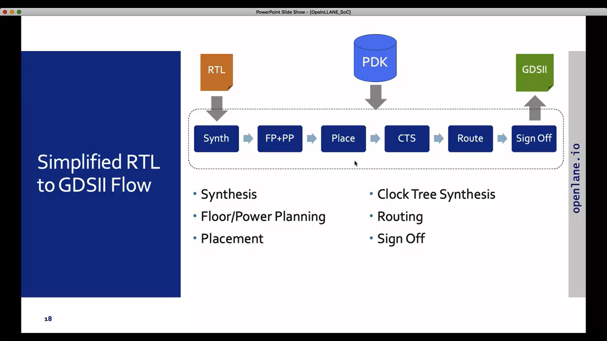
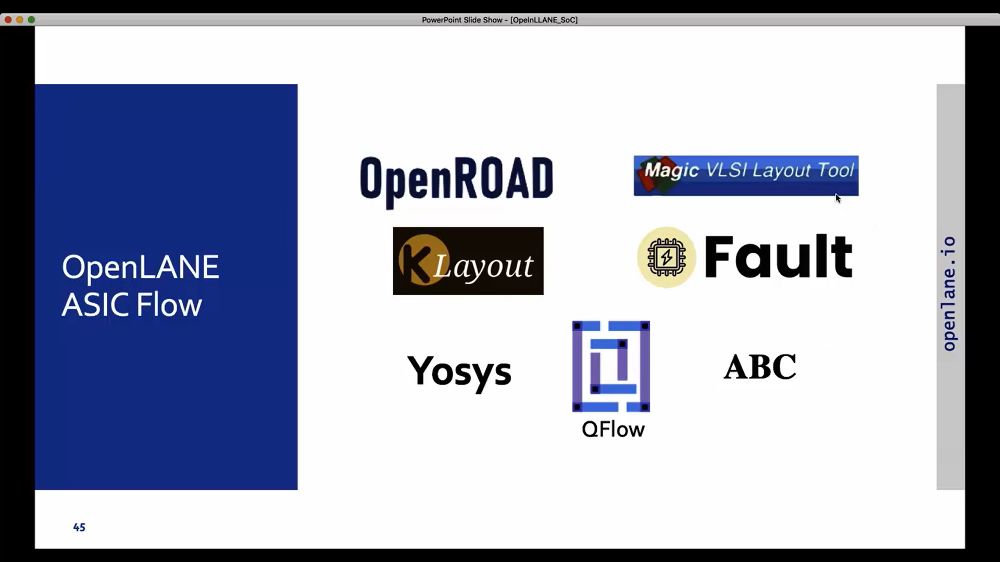
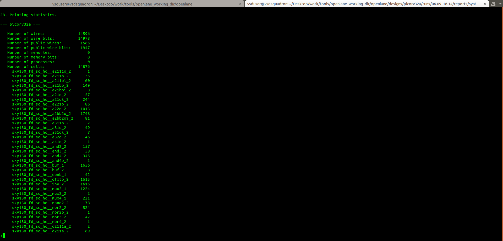
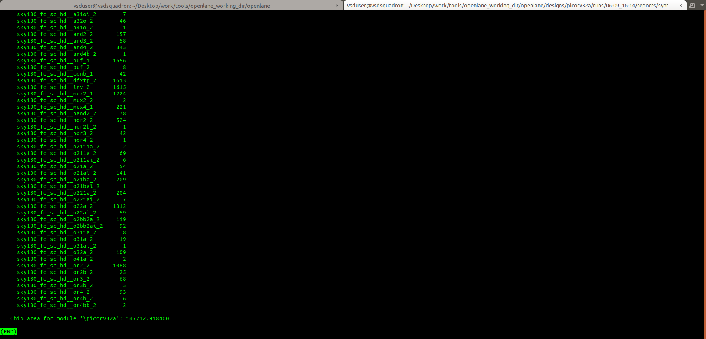

# Day 6 – Introduction to Physical Design and OpenLane

## Overview

This module introduces the physical design stage of the ASIC design flow and the open-source tools used to transform a synthesized RTL design into a physical chip implementation.

---

## ASIC Design Flow

The overall RTL-to-GDSII flow can be summarized as:

```text
RTL Design
    ↓
RTL Synthesis
    ↓
Gate-Level Netlist
    ↓
Static Timing Analysis
    ↓
Floorplanning
    ↓
Placement
    ↓
Clock Tree Synthesis
    ↓
Routing
    ↓
Parasitic Extraction
    ↓
Post-Route STA
    ↓
Physical Verification
    ↓
GDSII
```

## Open-Source ASIC Design Flow

The physical design flow studied in this module uses open-source EDA tools together with the **SKY130 Process Design Kit (PDK)**.

### Major Components

- **OpenLane** – RTL-to-GDSII implementation flow
- **Yosys** – RTL synthesis
- **OpenSTA** – Static Timing Analysis
- **OpenROAD** – Physical design implementation
- **Magic** – Layout viewing and physical verification
- **SKY130** – Open-source 130 nm technology PDK

The simplified RTL-to-GDSII implementation flow is:



---

## Open-Source EDA Tools

OpenLane integrates several open-source tools to automate different stages of the ASIC implementation flow.

Some of the tools and components used in the open-source ASIC ecosystem include:

- Yosys
- OpenROAD
- Magic
- KLayout
- ABC
- QFlow
- Fault



---

## SKY130 PDK

A **Process Design Kit (PDK)** provides the technology-specific information required by EDA tools to design and verify an integrated circuit.

The SKY130 PDK provides information such as:

- Standard-cell libraries
- Technology rules
- Design rules
- Device information
- Physical layer definitions
- Timing and power models
- Layout information

The PDK therefore acts as the technology interface between the design tools and the semiconductor manufacturing process.

---

## OpenLane

**OpenLane** is an automated RTL-to-GDSII implementation flow that integrates several open-source EDA tools.

A simplified OpenLane flow is:

```text
RTL
 ↓
Synthesis
 ↓
Floorplanning
 ↓
Placement
 ↓
Clock Tree Synthesis
 ↓
Routing
 ↓
Parasitic Extraction
 ↓
STA
 ↓
Physical Verification
 ↓
GDSII
```

## Physical Design

Physical design converts the synthesized logical representation of a circuit into a physical arrangement of standard cells, macros, and interconnects.

The major physical design stages include:

### 1. Floorplanning

Defines the physical boundaries of the design, including the core and die dimensions.

### 2. Placement

Determines the physical locations of standard cells within the core while considering wirelength, timing, congestion, and density.

### 3. Clock Tree Synthesis

Builds a clock distribution network to deliver the clock signal to sequential elements while controlling clock skew and insertion delay.

### 4. Routing

Creates physical interconnections between the placed cells.

### 5. Parasitic Extraction

Extracts the resistance and capacitance introduced by physical interconnects.

### 6. Physical Verification

Checks the physical implementation against manufacturing and connectivity requirements.

---

## Practical Work – Synthesis

The synthesis stage was performed using **Yosys** with the SKY130 standard-cell library.

The RTL was synthesized into a gate-level netlist mapped to SKY130 standard cells.

### Synthesis Statistics

The synthesis generated the following statistics:

- Number of wires: **14,596**
- Number of wire bits: **14,978**
- Number of public wires: **1,565**
- Number of cells: **14,876**
- Reported chip area: **147,712.918400**

The synthesis report also contains the breakdown of the different SKY130 standard-cell instances used in the synthesized design.





---

## Learning Outcomes

After completing this module, I gained an understanding of:

- The transition from RTL to physical implementation
- The role of a PDK in ASIC design
- The OpenLane RTL-to-GDSII flow
- The purpose of RTL synthesis
- The role of Yosys in synthesis
- The purpose of floorplanning and placement
- The relationship between logical synthesis and physical implementation
- The role of open-source EDA tools in ASIC design
- The major stages involved in an ASIC physical design flow

---

## Status

| Stage | Status |
|---|---|
| RTL Design | ✅ Completed |
| Synthesis | ✅ Completed |
| Floorplanning | ⏭️ Covered in Day 7 |
| Placement | ⏭️ Covered in Day 7 |
| Clock Tree Synthesis | ⏳ To be covered |
| Routing | ⏳ To be covered |
| Parasitic Extraction | ⏳ To be covered |
| Post-Route STA | ⏳ To be covered |
| Physical Verification | ⏳ To be covered |
| GDSII Generation | ⏳ To be covered |
