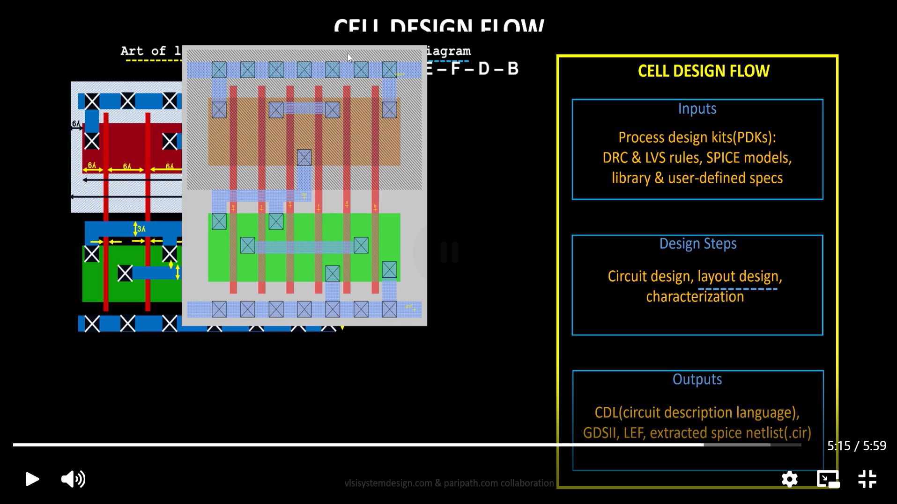
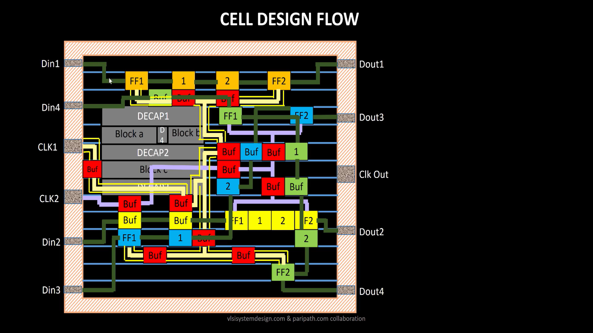
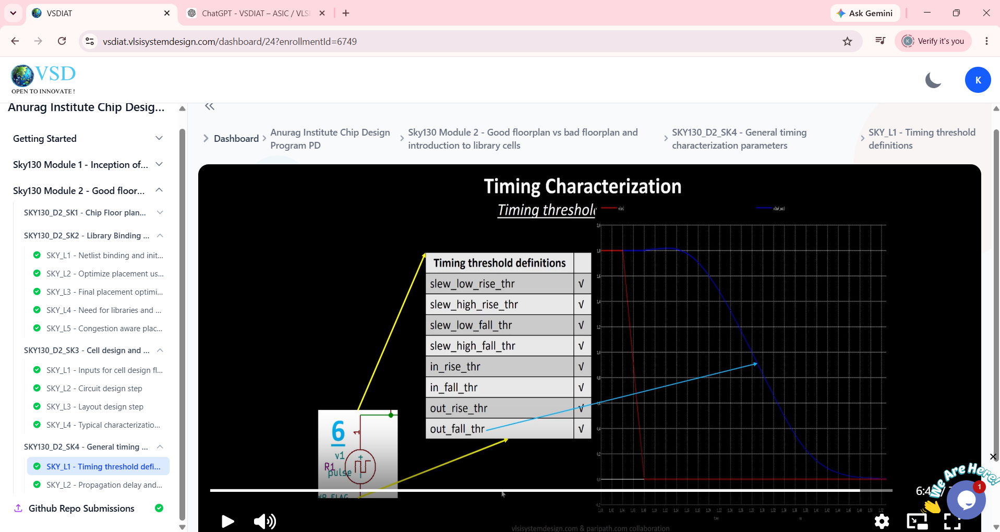
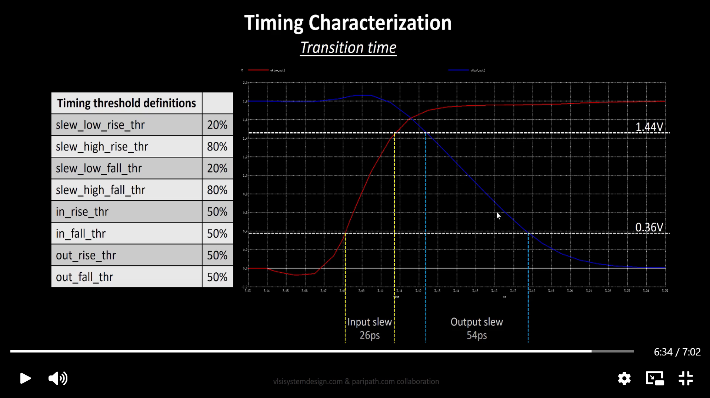
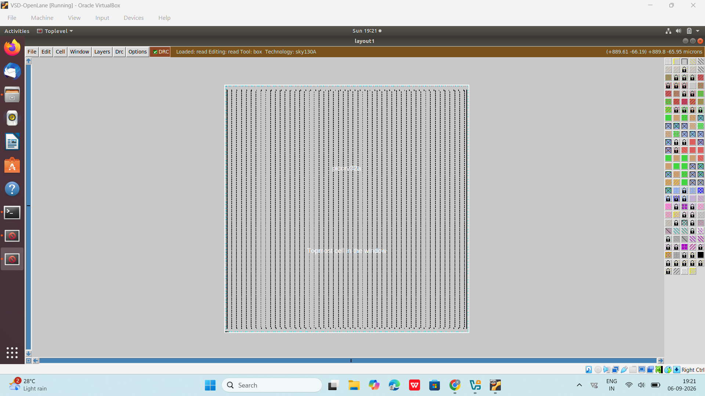
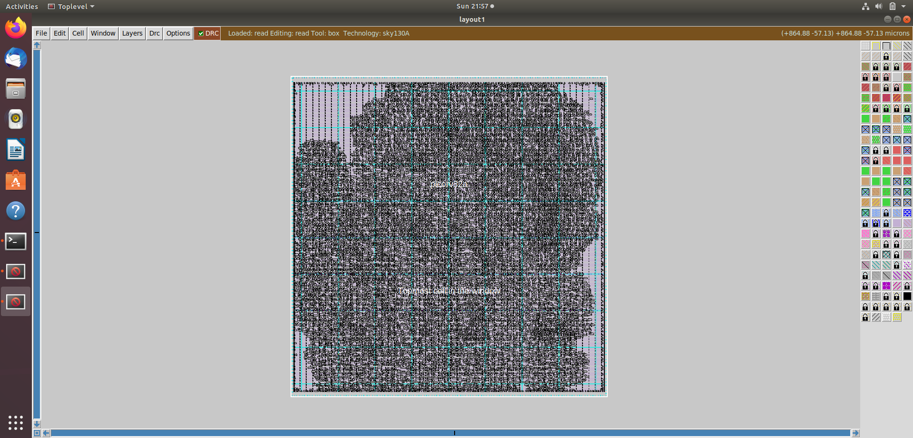

# Day 7 – Physical Design: Floorplanning, Placement and Timing Concepts

## Overview

Day 7 focused on the initial stages of **ASIC Physical Design** using the OpenLane flow and SKY130 PDK.

The main practical focus was on **floorplanning, placement and physical layout inspection using Magic**. Along with the practical work, important physical-design concepts such as Core and Die, Aspect Ratio, Core Utilization, Standard-Cell Design, Cell Characterization, Timing Characterization, Power Distribution and Static Timing Analysis (STA) were introduced.

The timing and cell-characterization topics were covered at an introductory level and will be studied in greater depth in the upcoming Physical Design modules.

---

## ASIC Physical Design Flow

After RTL synthesis, the design enters the Physical Design stage.

A simplified ASIC implementation flow is:

```text
RTL
 ↓
Synthesis
 ↓
Floorplanning
 ↓
Power Planning
 ↓
Placement
 ↓
Clock Tree Synthesis (CTS)
 ↓
Routing
 ↓
Parasitic Extraction
 ↓
Post-Route STA
 ↓
Physical Verification
 ↓
GDSII
```

Day 7 mainly focused on:

- Core and Die
- Floorplanning
- Aspect Ratio
- Core Utilization
- Standard-Cell Placement
- Power Distribution Network concepts
- Standard-Cell Design Flow
- Cell Characterization
- Timing Characterization
- Timing Thresholds
- STA fundamentals
- Physical layout inspection using Magic

---

## 1. Core and Die

The **Die** represents the complete physical area of the chip.

The **Core** is the main region inside the die where the standard cells and digital logic are placed.

A simplified representation is:

```text
+-----------------------------------+
|               DIE                 |
|                                   |
|       +-------------------+       |
|       |       CORE        |       |
|       |                   |       |
|       |   Standard Cells  |       |
|       |   and Logic       |       |
|       |                   |       |
|       +-------------------+       |
|                                   |
+-----------------------------------+
```

The relationship between the core and die is important because the available core area determines how much space is available for standard-cell placement and routing.

---

## 2. Floorplanning

**Floorplanning** is the process of defining the physical organization and dimensions of the design before detailed placement and routing.

Important floorplanning parameters include:

- Die width and height
- Core width and height
- Core utilization
- Aspect ratio
- I/O and pin locations
- Placement of pre-placed cells
- Power distribution structures

A good floorplan should provide sufficient area for placement and routing while avoiding excessive congestion.


### Aspect Ratio

The aspect ratio is defined as:

```text
Aspect Ratio = Height / Width
```

An aspect ratio of `1` represents a square core.

Changing the aspect ratio changes the physical shape of the core and can influence:

- Placement
- Routing congestion
- Wire length
- Timing

### Core Utilization

Core utilization represents the fraction of the available core area occupied by standard cells.

Conceptually:

```text
Core Utilization =
Area occupied by standard cells
--------------------------------
Available core area
```

Higher utilization gives a more compact design, but excessive utilization can lead to:

- Routing congestion
- Longer routing detours
- Placement difficulties
- Timing degradation
- Reduced optimization space

The utilization value shown in the training screenshot is an **example used to explain the concept**, not the measured utilization of this project.

---

## 3. Standard-Cell Design Flow

Standard cells are pre-designed logic building blocks used during ASIC implementation.

Examples include:

- Inverters
- NAND gates
- NOR gates
- Buffers
- Flip-flops
- Clock cells
- Decoupling cells

A simplified standard-cell design flow is:

```text
PDK + Design Specifications
          ↓
     Circuit Design
          ↓
      Layout Design
          ↓
     Characterization
          ↓
      Library Models
```

The physical layout of a cell must satisfy the required design rules and interface requirements so that it can be used reliably during physical implementation.



The figure illustrates the physical organization of different elements such as:

- Flip-flops
- Buffers
- Decoupling capacitors
- Blocks
- Interconnections
- Input and output connections

---

## 4. Cell Characterization

**Cell characterization** determines the electrical, timing and power behavior of a standard cell under different operating conditions.

A simplified characterization flow is:

```text
Cell Circuit
     ↓
Physical Layout
     ↓
SPICE Simulation
     ↓
Characterization
     ↓
Library Models
```

Characterization may determine parameters such as:

- Cell area
- Input capacitance
- Propagation delay
- Input transition
- Output transition
- Power characteristics
- Timing arcs

The characterized information is commonly represented in a **Liberty (`.lib`) file**.

These library models are important because synthesis and STA tools use them to estimate the behavior of standard cells.



> **Note:** Cell characterization was introduced as theory during the training. Detailed characterization and library generation were not performed as part of the Day 7 practical work.

---

## 5. Timing Characterization

**Timing characterization** describes how a standard cell responds to different input transitions and output loads.

Important timing parameters include:

- Input slew
- Output slew
- Propagation delay
- Rise transition
- Fall transition
- Input capacitance
- Output load

Cell timing depends on factors such as:

- Input transition
- Output capacitance/load
- Process
- Supply voltage
- Temperature

The resulting timing information is stored in the standard-cell timing library and is later used by STA.

### Timing Thresholds

Timing tools use defined voltage thresholds to measure signal transitions.

The training material introduced parameters such as:

```text
slew_low_rise_thr
slew_high_rise_thr
slew_low_fall_thr
slew_high_fall_thr

in_rise_thr
in_fall_thr
out_rise_thr
out_fall_thr
```

Rise and fall slew measurements are based on defined lower and upper voltage thresholds, while input and output timing thresholds are used to determine signal transition points.



The voltage and percentage values shown in the training material are **example values used for explanation**. They are not measurements from the `picorv32a` implementation.

---

## 6. Input and Output Slew

**Slew** represents how quickly a signal transitions between logic levels.

A rising transition is:

```text
LOW → HIGH
```

A falling transition is:

```text
HIGH → LOW
```

The transition time is measured between defined voltage thresholds.

The training material demonstrates the measurement of input and output slew using example waveforms.



The values shown in this training example, such as input slew and output slew, are **illustrative values** and are not results measured from this project.

Detailed timing characterization and slew analysis will be covered progressively in later modules.

---

## 7. Static Timing Analysis (STA)

**Static Timing Analysis (STA)** is used to verify whether the design satisfies its timing constraints.

Unlike functional simulation, STA analyzes timing paths using timing information from the standard-cell libraries and design constraints.

A simplified timing path can be represented as:

```text
Startpoint
    ↓
Combinational Logic
    ↓
Interconnect
    ↓
Endpoint
```

### Arrival Time

The time at which a signal reaches an endpoint.

### Required Time

The latest acceptable time at which the signal should reach the endpoint while satisfying the timing constraint.

### Slack

```text
Slack = Required Time - Arrival Time
```

Generally:

```text
Positive Slack → Timing requirement satisfied
Negative Slack → Timing violation
```

Physical implementation affects timing because placement and routing determine interconnect distances and parasitic effects.

Detailed STA analysis will be covered in later Physical Design modules.

---

## 8. Power Distribution Network (PDN)

Standard cells require a reliable supply of:

- VDD
- VSS / GND

The **Power Distribution Network (PDN)** distributes power throughout the design using structures such as:

- Power rings
- Power straps
- Standard-cell power rails

A simplified representation is:

```text
        VDD
====================
   |     |     |
   |     |     |
====================
    Power Straps
====================
   |     |     |
   |     |     |
====================
        VSS
```

The objective is to provide stable power to the cells while minimizing voltage drop and power-integrity problems.

---

## 9. IR Drop

When current flows through the resistance of the power network, a voltage drop occurs.

The basic relationship is:

```text
V = I × R
```

where:

- `V` = voltage drop
- `I` = current
- `R` = resistance

Excessive IR drop can reduce the effective supply voltage available to cells and may affect circuit performance.

Therefore, power planning is an important part of physical design.

---

## 10. Decoupling Capacitors

**Decoupling capacitors (Decaps)** are physical cells used to help stabilize the local power supply.

They can provide temporary charge during rapid changes in current demand and help reduce local supply-voltage fluctuations.

Decaps are therefore an important part of power-integrity planning.

---

## 11. LEF and DEF

Two important physical-design file formats used during ASIC implementation are **LEF** and **DEF**.

### LEF – Library Exchange Format

LEF provides the physical abstract information of standard cells and technology.

It may contain:

- Cell dimensions
- Pin locations
- Metal layers
- Routing information
- Obstructions

### DEF – Design Exchange Format

DEF describes the physical implementation of a particular design.

It may contain:

- Die area
- Components
- Cell locations
- Nets
- Placement information
- Physical coordinates

A simple way to remember:

```text
LEF → Physical abstract information of cells

DEF → Physical implementation of the design
```

---

## 12. Practical OpenLane Work

The practical work in Day 7 focused on the initial physical implementation stages.

The flow can be summarized as:

```text
Synthesized Netlist
        ↓
   Floorplanning
        ↓
     Placement
        ↓
Magic Layout Inspection
```

The `picorv32a` design was taken through the floorplanning and placement stages, and the generated physical layout was inspected using Magic.

---

## 13. Floorplan Result

The generated floorplan was inspected to understand the physical boundary and organization of the design.



The floorplan establishes the physical region in which standard cells and other physical structures are implemented.

---

## 14. Placement Result

After floorplanning, the standard cells are placed within the core area.

Placement considers factors such as:

- Cell locations
- Timing
- Wire length
- Congestion
- Placement legality
- Power distribution

The resulting placement was inspected using Magic.



The dense collection of standard cells demonstrates the transition from an abstract synthesized netlist to a physical implementation.

---

## 15. Magic Layout Inspection

**Magic** was used to inspect the physical layout generated during the OpenLane flow.

This provided practical exposure to the difference between the logical design and its physical implementation.

```text
RTL
 ↓
Synthesis
 ↓
Gate-Level Netlist
 ↓
Floorplan
 ↓
Placement
 ↓
Physical Layout
```

The Magic layout view provides a visual representation of the physical locations of standard cells and the overall design organization.

---

## 16. Day 7 Learning Summary

### Theory Studied

- Core and Die
- Floorplanning
- Aspect Ratio
- Core Utilization
- Standard-cell design flow
- Cell characterization
- Timing characterization
- Timing thresholds
- Input and output slew
- STA fundamentals
- Power Distribution Network
- IR Drop
- Decoupling capacitors
- LEF and DEF
- Physical layout concepts

### Practical Work

- Worked with the OpenLane physical-design flow
- Generated and inspected the floorplan
- Generated and inspected the placement
- Used Magic for physical layout inspection
- Observed standard-cell placement in the physical design

---

## 17. Day 7 Status

| Topic | Status |
|---|---|
| Core and Die | ✅ Studied |
| Floorplanning | ✅ Studied + Practical |
| Aspect Ratio | ✅ Studied |
| Core Utilization | ✅ Studied |
| Standard-cell Placement | ✅ Studied + Practical |
| Standard-cell Design Flow | 📖 Theory Introduced |
| Cell Characterization | 📖 Theory Introduced |
| Timing Characterization | 📖 Theory Introduced |
| Timing Thresholds | 📖 Theory Introduced |
| Input/Output Slew | 📖 Theory Introduced |
| STA Fundamentals | 📖 Introduced |
| Power Distribution Network | 📖 Studied |
| IR Drop | 📖 Studied |
| Decoupling Capacitors | 📖 Studied |
| LEF / DEF | 📖 Studied |
| Magic Layout Inspection | ✅ Practical |
| Clock Tree Synthesis | ⏳ To be covered |
| Routing | ⏳ To be covered |
| Parasitic Extraction | ⏳ To be covered |
| Post-Route STA | ⏳ To be covered |
| Physical Verification | ⏳ To be covered |
| GDSII Generation | ⏳ To be covered |

---

## Conclusion

Day 7 introduced the fundamentals of **ASIC Physical Design**, with practical focus on floorplanning, placement and physical layout inspection using Magic.

The training also introduced standard-cell design, cell characterization and timing concepts. These topics were studied at an introductory level, while detailed timing characterization, STA and the remaining Physical Design stages will be covered progressively in the upcoming modules.
