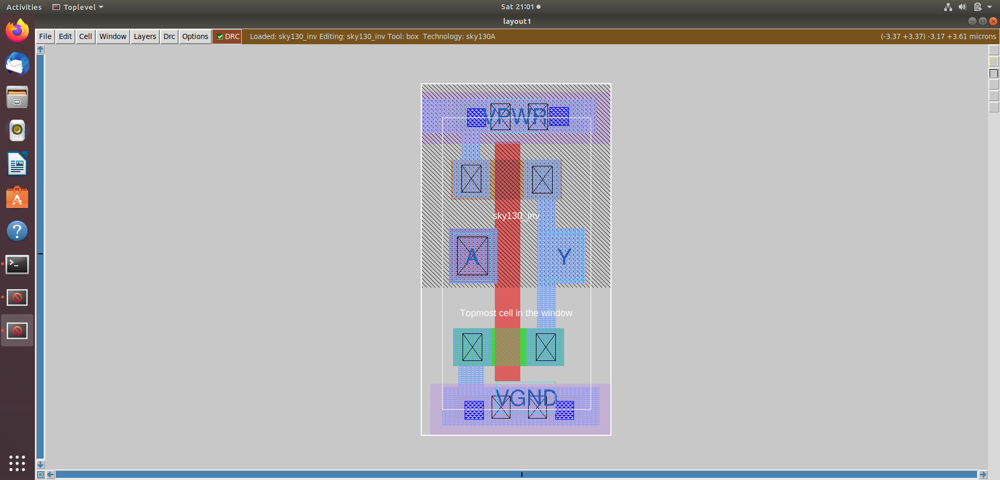
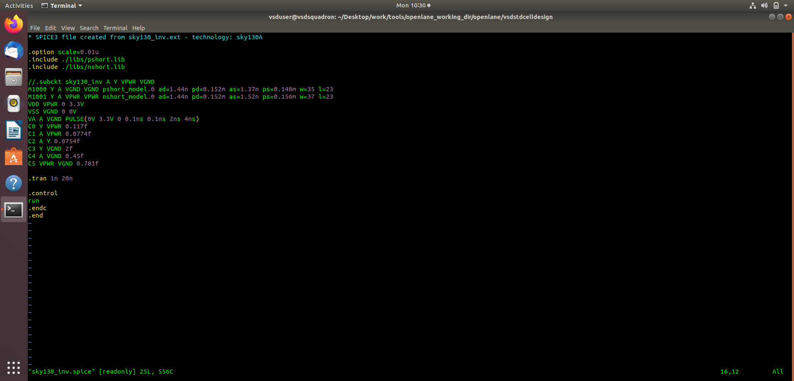
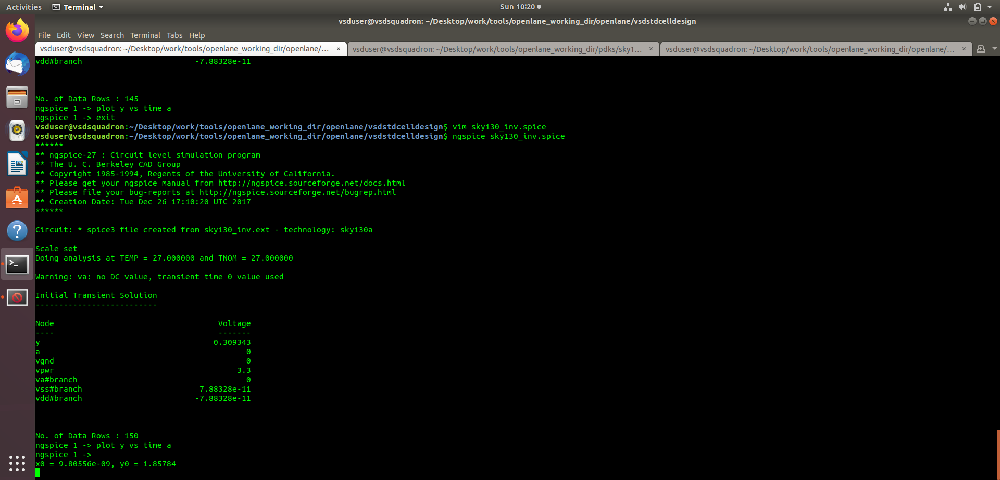
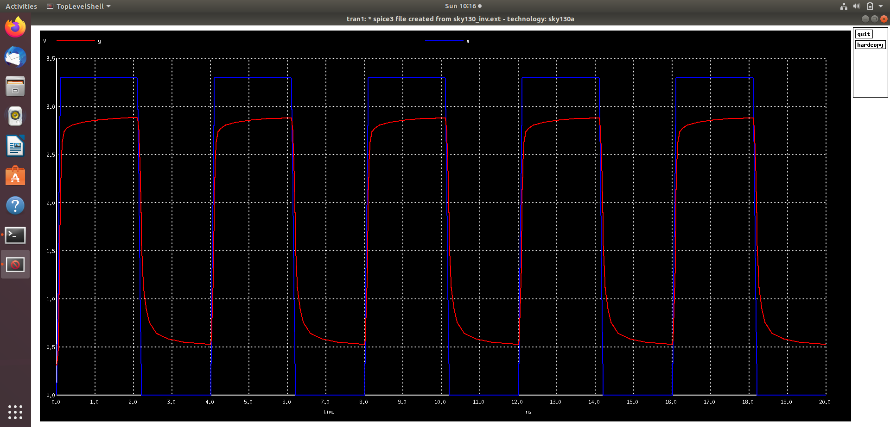

# Day 8 – CMOS Fundamentals, Fabrication, SPICE & SKY130 Standard Cell Design

## Overview

Day 8 focused on understanding CMOS technology from the device and fabrication level through physical layout and electrical simulation.

The session connected the following concepts:

```text
CMOS Fundamentals
        ↓
CMOS Inverter
        ↓
CMOS Robustness
        ↓
SPICE Deck
        ↓
CMOS Fabrication
        ↓
SKY130 PDK
        ↓
Magic VLSI
        ↓
Standard Cell Layout
        ↓
SPICE Extraction
        ↓
ngspice Simulation
        ↓
Transient Analysis
```

The practical work focused on a custom **SKY130 CMOS inverter (`sky130_inv`)**, including its physical layout, SPICE extraction and transient simulation.

---

## 1. SPICE Deck

A **SPICE deck** is a text-based description of an electrical circuit that can be interpreted by a SPICE simulator.

A typical SPICE deck contains:

- Device definitions
- Model definitions
- Circuit connectivity
- Power supplies
- Input sources
- Load elements
- Simulation commands
- Control commands

For the CMOS inverter, the circuit consists of:

- PMOS transistor
- NMOS transistor
- Input `A`
- Output `Y`
- Supply `VPWR`
- Ground `VGND`
- Load capacitance

A simplified CMOS inverter is:

```text
             VPWR
               |
              PMOS
               |
               +------ Y
               |
              NMOS
               |
              VGND

                 A
                 |
          Gates of PMOS/NMOS
```

The SPICE representation allows the electrical behavior of the circuit to be simulated using transistor-level models.

---

## 2. CMOS Inverter

The CMOS inverter is one of the fundamental building blocks of digital IC design.

It consists of a complementary pair of:

- PMOS transistor
- NMOS transistor

The two transistors are controlled by the same input.

### Input LOW

When:

```text
A = 0
```

the PMOS is ON and the NMOS is OFF.

Therefore:

```text
Y ≈ VPWR
```

### Input HIGH

When:

```text
A = 1
```

the PMOS is OFF and the NMOS is ON.

Therefore:

```text
Y ≈ VGND
```

Hence the Boolean behavior is:

```text
Y = ~A
```

or:

```text
A = 0  →  Y = 1
A = 1  →  Y = 0
```

---

## 3. CMOS Robustness

The robustness of a CMOS inverter determines how reliably it interprets and generates digital logic levels in the presence of noise and electrical variations.

Important voltage parameters include:

- `VOH` – minimum output voltage recognized as logic HIGH
- `VOL` – maximum output voltage recognized as logic LOW
- `VIH` – minimum input voltage recognized as logic HIGH
- `VIL` – maximum input voltage recognized as logic LOW

The noise margins are:

```text
NMH = VOH - VIH

NML = VIL - VOL
```

A larger noise margin generally provides better tolerance to unwanted voltage disturbances.

The CMOS inverter therefore provides both:

- Logic inversion
- Noise immunity

These properties are important when CMOS gates are connected together to form larger digital circuits.

---

## 4. CMOS Switching Behavior

During an input transition, both transistor characteristics and circuit capacitances influence the output waveform.

The output does not change instantaneously because a real CMOS circuit contains:

- Transistor resistance
- Gate capacitance
- Diffusion capacitance
- Interconnect capacitance
- Load capacitance

Therefore, the output has finite:

- Rise time
- Fall time
- Propagation delay

This becomes increasingly important in high-speed digital ASIC design.

---

## 5. 16-Mask CMOS Fabrication Process

The session covered the basic CMOS fabrication sequence using a **16-mask CMOS process**.

The fabrication process involves creating the physical structures required to form NMOS and PMOS transistors and their interconnections.

The major concepts covered include:

1. Silicon wafer preparation
2. Well formation
3. Isolation
4. Active-region formation
5. Gate oxide formation
6. Polysilicon gate formation
7. Source/drain implantation
8. Spacer formation
9. Additional implantation steps
10. Inter-layer dielectric formation
11. Contact formation
12. Metal formation
13. Additional interconnect layers
14. Passivation
15. Pad/opening formation
16. Final processing

The overall objective is to construct:

```text
Silicon
   ↓
Wells
   ↓
Active Regions
   ↓
Gate
   ↓
Source / Drain
   ↓
Contacts
   ↓
Metal Interconnects
   ↓
Completed CMOS Circuit
```

---

## 6. Well Formation and CMOS Structure

CMOS technology requires appropriate well structures so that NMOS and PMOS devices can be fabricated on the same substrate.

The session covered:

- N-well
- P-well
- Substrate
- Dopant implantation
- Active regions

The well structure provides the required body regions for the complementary MOS devices.

Conceptually:

```text
        PMOS
         │
       N-Well
─────────┼─────────
       Substrate
         │
        NMOS
```

The actual structure depends on the specific CMOS process technology.

---

## 7. Masking and Photolithography

Photolithography and masking are used to define different physical regions of the semiconductor device.

Different masks can be used to define structures such as:

- Wells
- Active regions
- Polysilicon
- Implant regions
- Contacts
- Metal layers

The fabrication process can therefore be understood as a sequence of patterning and material-processing operations.

```text
Mask
 ↓
Pattern Transfer
 ↓
Etching / Implantation / Deposition
 ↓
Physical Structure
```

Repeating these steps allows increasingly complex CMOS structures to be constructed on the wafer.

---

## 8. SkyWater and SKY130 PDK

The session introduced the **SkyWater open-source semiconductor technology ecosystem** and the **SKY130 Process Design Kit (PDK)**.

The SKY130 PDK provides technology-specific information needed for IC design and physical implementation, including:

- Technology layers
- Design rules
- Device information
- Standard-cell libraries
- LEF information
- Liberty timing libraries
- SPICE models
- Technology files

The PDK acts as the technology interface between the design tools and the semiconductor fabrication process.

The SKY130 technology was used for the custom CMOS inverter exercise.

---

## 9. Introduction to Magic VLSI

**Magic** is a VLSI layout tool used to create, inspect and verify integrated-circuit layouts.

Magic was introduced as the physical-design tool used for the custom SKY130 inverter.

Important capabilities include:

- Physical layout creation
- Layer inspection
- Design Rule Checking (DRC)
- Circuit extraction
- Layout visualization
- Technology-specific physical design

The physical layout represents the geometries that correspond to structures fabricated on silicon.

---

## 10. Custom SKY130 CMOS Inverter Layout

A custom CMOS inverter was implemented using Magic with the SKY130A technology.

The layout contains the physical structures corresponding to:

- PMOS
- NMOS
- Input `A`
- Output `Y`
- `VPWR`
- `VGND`

The layout was inspected using Magic and used as the source for subsequent SPICE extraction.



---

## 11. SPICE Extraction from Layout

After creating the physical layout, the circuit was extracted into a SPICE representation.

The extracted SPICE description contains information about:

- MOS transistors
- Device dimensions
- Device connectivity
- Parasitic capacitances
- Power connections
- Ground connections

The extraction process establishes the relationship:

```text
Physical Layout
       ↓
     Magic
       ↓
SPICE Extraction
       ↓
Extracted Circuit
       ↓
Electrical Simulation
```

This is important because the extracted circuit represents the electrical implementation of the physical layout rather than only its ideal Boolean behavior.



---

## 12. ngspice Transient Simulation

The extracted inverter was simulated using **ngspice**.

The simulation included:

- `VPWR = 3.3 V`
- `VGND = 0 V`
- Pulsed input signal
- Load capacitance
- Transient analysis

The input stimulus was applied to the inverter and the output response was observed.

The transient simulation was performed over:

```text
Simulation time = 20 ns
Transient step   = 1 ns
```



---

## 13. Transient Waveform

The input `A` and output `Y` waveforms were plotted using ngspice.

The simulation demonstrates the expected inverter relationship:

```text
A = LOW   →   Y = HIGH

A = HIGH  →   Y = LOW
```

The output waveform has finite rise and fall times because the physical circuit contains transistor and parasitic capacitances.

The waveform therefore demonstrates both:

- Logical inversion
- Electrical behavior of the physical circuit



---

## 14. From Physical Layout to Electrical Verification

One of the major learning outcomes from Day 8 was understanding how physical design and circuit simulation are connected.

The complete process can be represented as:

```text
CMOS Transistor Design
        ↓
Physical Layout
        ↓
Magic
        ↓
DRC / Physical Verification
        ↓
SPICE Extraction
        ↓
Extracted Netlist + Parasitics
        ↓
ngspice
        ↓
Transient Analysis
        ↓
Electrical Verification
```

This demonstrates that the physical implementation of a circuit directly influences its electrical behavior.

---

## 15. Standard Cell Perspective

The custom inverter was studied as a potential **standard-cell building block**.

A standard cell requires a well-defined physical and logical interface.

Important characteristics include:

- Defined cell dimensions
- Power connections
- Ground connections
- Input pins
- Output pins
- Technology-compliant geometry
- Routing compatibility
- Timing information
- Electrical characterization

The custom inverter therefore represents the connection between transistor-level design and the standard-cell libraries used by ASIC implementation tools.

```text
CMOS Transistor Design
        ↓
Custom Inverter
        ↓
Physical Layout
        ↓
DRC / Extraction
        ↓
Electrical Characterization
        ↓
Standard Cell
        ↓
ASIC Standard-Cell Library
```

---

## 16. Key Learning Outcomes

### CMOS

- CMOS inverter operation
- PMOS/NMOS complementary behavior
- CMOS switching
- Noise margins
- CMOS robustness
- Rise and fall behavior
- Propagation delay

### Fabrication

- CMOS fabrication flow
- 16-mask process
- N-well and P-well formation
- Active-region formation
- Gate formation
- Source/drain implantation
- Contacts
- Metal interconnects
- Photolithography and masking

### SPICE

- SPICE deck structure
- Device models
- Circuit connectivity
- Power supplies
- Input stimulus
- Load capacitance
- Transient simulation
- Extracted circuit representation

### SKY130

- SkyWater technology
- SKY130 PDK
- Technology layers
- Standard-cell libraries
- Technology-specific design information

### Magic

- VLSI layout
- SKY130 technology setup
- Physical layer inspection
- DRC
- SPICE extraction
- Standard-cell layout

### Simulation

- ngspice
- Transient analysis
- Input/output waveform interpretation
- Electrical verification
- Parasitic effects

---

## 17. Important Engineering Connection

A major takeaway from Day 8 is that ASIC design involves several abstraction levels.

```text
Transistor
    ↓
Logic Gate
    ↓
Standard Cell
    ↓
RTL
    ↓
Synthesized Netlist
    ↓
Physical Layout
    ↓
Extracted Circuit
    ↓
Electrical Verification
```

For example, the logical inverter can be represented as:

```text
Y = ~A
```

but its physical implementation also has:

- Transistor dimensions
- Drive strength
- Resistance
- Capacitance
- Propagation delay
- Rise time
- Fall time
- Power characteristics
- Physical dimensions

Therefore, physical implementation is not independent of circuit behavior.

---

## 18. Day 8 Summary

Day 8 established the connection between **CMOS device fundamentals, semiconductor fabrication, physical layout, SPICE extraction and electrical simulation**.

The session covered the CMOS inverter from multiple levels:

```text
Device Level
     ↓
Circuit Level
     ↓
Fabrication Level
     ↓
Layout Level
     ↓
SPICE Level
     ↓
Simulation Level
```

A custom SKY130 CMOS inverter was implemented using Magic, extracted into SPICE and simulated using ngspice.

The transient waveform confirmed the expected inverter behavior and demonstrated the effect of real electrical characteristics such as finite transition time and capacitance.

This forms an important foundation for understanding how standard cells are created and subsequently used in the larger ASIC design flow.

---

## 19. References

The following resources were referred to during the training session as recommended by the trainer.

### SkyWater SKY130 PDK Documentation

SkyWater SKY130 PDK documentation was used as a reference for:

- SKY130 technology
- PDK concepts
- Technology information
- Process-related information
- Design rules
- Device and library information

Reference:

https://skywater-pdk.readthedocs.io/en/main/

### Magic VLSI

Magic VLSI documentation and project information were used as a reference for:

- Magic VLSI layout
- Physical design
- Layout editing
- Design Rule Checking
- Circuit extraction
- Technology-specific layout operations

Reference:

https://opencircuitdesign.com/magic/
